# WealthTracker Backend

> 단순 가계부 CRUD를 넘어서,  
> `회원 인증 -> 거래 기록 -> 월간 비교/목표 관리 -> 예정 결제 관리 -> 주간 AI 피드백`까지 한 흐름으로 연결한 개인 재무 관리 백엔드입니다.

## 📚 목차

- [1. 프로젝트 한눈에 보기](#overview)
- [2. 왜 이 프로젝트가 단단한가](#why-strong)
- [3. 시스템 전체 구조](#system-architecture)
- [4. 기술 스택과 저장소 역할](#tech-stack)
- [5. 백엔드 처리 구조](#backend-architecture)
- [6. 상세 기능 설명](#feature-details)
- [7. API 인벤토리](#api-inventory)
- [8. 데이터 모델](#data-model)
- [9. 운영 / 배포 / 관측](#operations)
- [10. 테스트와 품질 관리](#testing)


<a id="overview"></a>
## 1. 프로젝트 한눈에 보기

### 1-1. 이 서비스가 해결하려는 문제

많은 개인 재무 서비스는 아래 문제에서 멈춥니다.

- 돈을 썼는지 기록은 되지만, 어디에 과하게 쓰는지 바로 읽히지 않는다.
- 수입과 지출이 따로 놀아서 한 달 흐름이 끊겨 보인다.
- 목표 저축, 예정 결제, 현재 소비 패턴이 한 화면의 문맥으로 이어지지 않는다.
- 사용자는 숫자 목록보다 "이번 주 내가 어떤 소비를 했는지" 해석된 피드백을 원한다.
- 거래 데이터가 쌓여도 운영 관점에서 인증, 검증, 캐시, 락, 배포, 관측까지 같이 설계되지 않으면 서비스는 금방 흔들린다.

WealthTracker는 이 문제를 다음 구조로 해결합니다.

- 이메일 인증과 JWT 기반 로그인으로 사용자 식별을 명확히 한다.
- 지출/수입/예정 결제/저축 목표를 개별 기능이 아니라 하나의 재무 운영 흐름으로 묶는다.
- 월간/주간 집계, 카테고리 목표 비교, 최근 내역 조회를 API로 분리해 프론트가 재무 대시보드를 구성하기 쉽게 만든다.
- Gemini API를 통해 이번 주 소비 패턴을 자연어 피드백으로 요약한다.
- 캐시, 스케줄러, named lock, 예외 처리, Actuator/Prometheus 같은 운영 장치를 코드 안에 함께 둔다.

### 1-2. 이 레포지토리에서 확인할 수 있는 백엔드 역량

| 항목 | 코드 기준 포인트 |
| --- | --- |
| 인증/인가 | 이메일 인증코드 발송, 비밀번호 재설정, JWT 발급/검증, Security Filter |
| 도메인 | 지출, 수입, 통합 거래내역, 저축 목표, 카테고리 목표, 예정 결제, 프로필, 피드백 |
| 외부 연동 | Naver SMTP, Kakao OAuth2 UserInfo, Google Gemini |
| 데이터 접근 | Spring Data JPA, MySQL, 커스텀 JPQL/Native Query |
| 성능/운영 | Caffeine Cache, HikariCP, Actuator, Prometheus, log4jdbc |
| 정합성 | MySQL `GET_LOCK` 기반 커스텀 카테고리 생성 보호 |
| 배포 | `Dockerfile`, `appspec.yml`, `start.sh`, `stop.sh` 기반 EC2/CodeDeploy 배포 구조 |
| 테스트 | DTO 유효성 검사 테스트, 동시 카테고리 생성 시나리오 테스트 |

### 1-3. 팀 프로젝트에서의 개인 기여도

이 프로젝트는 3인 협업으로 진행됐고, 포트폴리오 관점에서 제가 주도적으로 가져간 영역은 아래와 같습니다.

| 구분 | 기여 내용 |
| --- | --- |
| 김도연 주도 구현 | 지출 API, 수입 API, 월간/주간 집계 응답, Gemini 기반 주간 피드백 API, 피드백 스케줄러, `ErrorCode` 세분화, 운영/배포 흐름 정리 |
| 박재성 주도 구현 | 이메일 인증 회원가입, JWT 로그인 보안, 프로필 API, 저축 목표 API, 카테고리별 지출 목표 API |
| 정현아 주도 구현 | 예정 결제 API |
| 공동 작업 | ERD 설계, 전체 도메인 연결, API 문서화 |


### 1-5. 서비스 전체 비즈니스 흐름

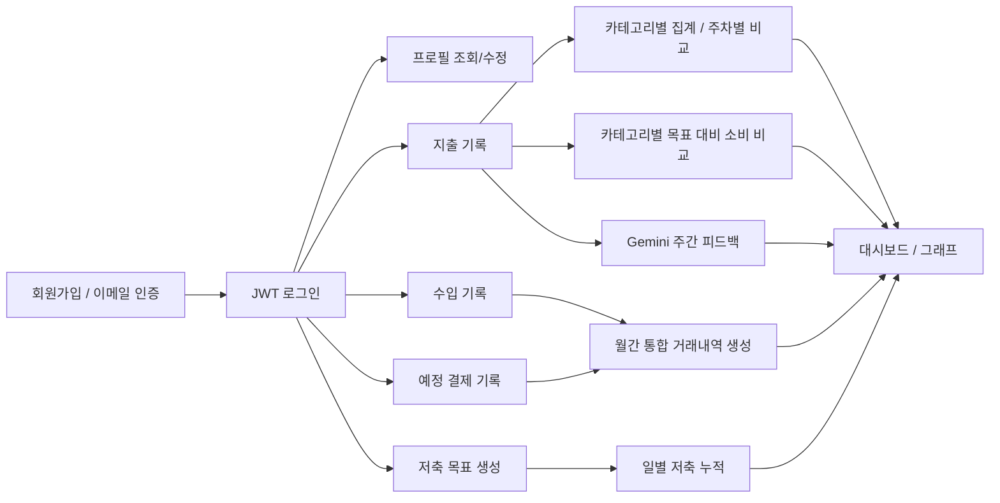

### 1-6. 핵심 메시지

이 프로젝트의 강점은 "기록" 자체가 아니라,  
기록된 거래를 `검증 가능한 데이터`, `비교 가능한 숫자`, `행동을 유도하는 피드백`으로 바꾸는 백엔드 조립력에 있습니다.

### 1-7. 이 프로젝트를 강하게 만드는 설계 원칙

| 설계 원칙 | 실제 코드에서 보이는 구현 |
| --- | --- |
| 식별 가능성 | 이메일 인증코드, JWT claim, `userId` 기반 사용자 식별 |
| 정합성 우선 | 사용자 소유권 검증, 커스텀 카테고리 named lock |
| 읽히는 데이터 | 주차 비교, 카테고리별 비교, 통합 거래 타임라인 |
| 재호출 비용 절감 | Caffeine 캐시, 주간 피드백 재사용 전략 |
| 운영 대비 | Actuator, Prometheus, log4jdbc, 배포 스크립트 |
| 확장 가능성 | Kakao OAuth2 확장 포인트, 인프라 패키지 분리, 도메인별 서비스 분리 |

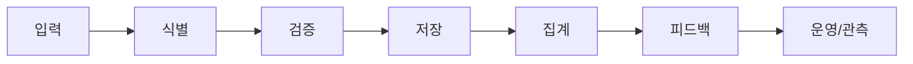

<a id="why-strong"></a>

### 2-1. 흐름

- 회원가입과 로그인만 있는 서비스가 아니라 이메일 인증, 비밀번호 재설정, 프로필 변경까지 사용자 수명주기를 다룬다.
- 지출/수입만 있는 서비스가 아니라 월간 통합 거래내역, 카테고리별 목표, 저축 목표, 예정 결제까지 재무 문맥을 만든다.
- 집계 숫자만 보여주는 것이 아니라 Gemini 기반 주간 피드백까지 연결한다.

### 2-2. 운영을 생각한 요소

- `GlobalExceptionHandler`로 예외를 한 군데서 정리한다.
- `JwtAuthFilter`와 `JwtUtil`로 토큰 해석 책임을 분리한다.
- `Caffeine` 캐시로 주차 비교 그래프 계산을 줄인다.
- `GET_LOCK` 기반 named lock으로 커스텀 카테고리 동시 생성 경쟁 조건을 막는다.
- `@Scheduled` 작업으로 피드백 라이프사이클을 관리한다.
- `Actuator`, `Prometheus`, `log4jdbc`, `Pinpoint-ready Dockerfile`로 운영 가시성을 확보하려는 흔적이 남아 있다.


### 2-4. 실패 시나리오 제어 구조


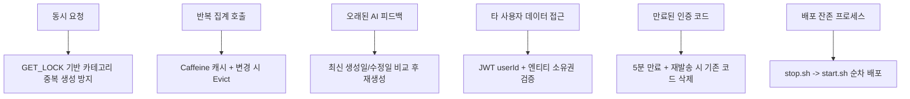

| 깨질 수 있는 지점 | 대응 방식 |
| --- | --- |
| 같은 커스텀 카테고리의 동시 생성 | MySQL `GET_LOCK`으로 임계구역 보호 |
| 주차 비교 API의 반복 호출 | `@Cacheable("expendWeekCache")`와 변경 시 `@CacheEvict` |
| 거래가 바뀌었는데 예전 피드백이 남는 문제 | 최신 생성일/수정일과 피드백 생성일 비교 후 재생성 |
| 다른 사용자의 거래 상세 조회/수정/삭제 | JWT에서 추출한 `userId`와 엔티티 소유자 비교 |
| 인증 코드 재사용/중복 누적 | 기존 코드 삭제 후 새 코드 저장, 만료 시간 5분 설정 |
| 배포 시 이전 프로세스 잔존 | `appspec.yml` + `stop.sh` + `start.sh`로 정리 후 재기동 |

<a id="system-architecture"></a>
## 3. 시스템 전체 구조

### 3-1. 시스템 컨텍스트

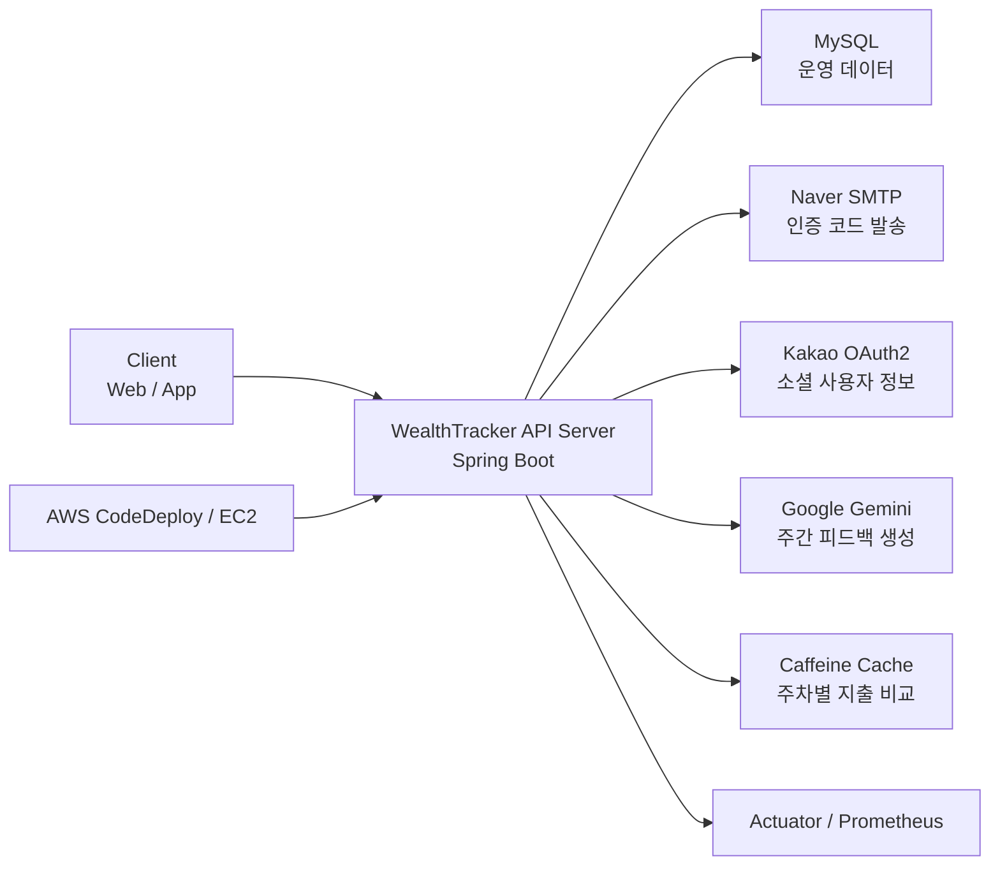

### 3-2. 요청이 내부에서 지나가는  경로

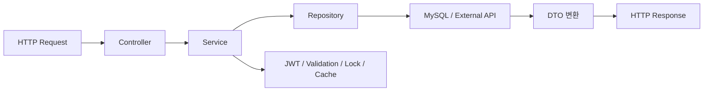

### 3-3. 저장소와 외부 시스템 역할

| 구성요소 | 역할 |
| --- | --- |
| MySQL | 사용자, 인증 코드, 지출, 수입, 목표, 결제, 피드백 등 핵심 운영 데이터 저장 |
| Caffeine Cache | 주차별 지출 비교 API 결과 캐싱 |
| Naver SMTP | 회원가입/비밀번호 재설정 인증코드 발송 |
| Kakao OAuth2 | 카카오 사용자 정보를 받아 JWT로 연결하는 확장 로그인 구조 |
| Google Gemini | 사용자의 이번 주 소비를 자연어 피드백으로 요약 |
| Actuator / Prometheus | 헬스체크와 메트릭 노출 |
| Pinpoint-ready Dockerfile | APM 적용을 고려한 런타임 정의 |

### 3-4. 패키지 기준 시스템 분해

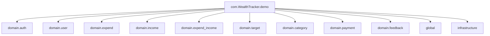

### 3-5. 요청 1건에 함께 작동하는 방어선

```mermaid
flowchart LR
    A["Client Request"] --> B["CORS / Security FilterChain"]
    B --> C["JWT Parsing"]
    C --> D["Controller"]
    D --> E["DTO Validation"]
    E --> F["Service"]
    F --> G["User Lookup / Ownership Check"]
    G --> H["Lock / Cache / Scheduler-aware Logic"]
    H --> I["Repository"]
    I --> J["MySQL / External API"]
    J --> K["DTO Response"]
    K --> L["GlobalExceptionHandler / Status Code"]
```

이 다이어그램의 포인트는 단순합니다.  
요청은 Controller 하나만 통과하는 것이 아니라, 인증, 검증, 사용자 확인, 정합성 제어, 예외 처리까지 여러 방어선을 함께 통과합니다.

<a id="tech-stack"></a>
## 4. 기술 스택과 저장소 역할

### 4-1. 기술 스택

| 분류 | 기술 |
| --- | --- |
| Language | Java 17 |
| Framework | Spring Boot 3.3.4 |
| Security | Spring Security, JWT, OAuth2 Client |
| ORM | Spring Data JPA |
| DB | MySQL |
| Cache | Spring Cache + Caffeine |
| Mail | Spring Mail |
| API Docs | Springdoc OpenAPI, Swagger UI |
| AI | Google Gemini REST 호출 |
| Observability | Actuator, Prometheus, log4jdbc |
| Build | Gradle |
| Deploy | Docker, AWS CodeDeploy 스크립트 |
| Test | JUnit5, Spring Boot Test |

### 4-2. 왜 이 조합이 좋은가

- 관계형 정합성이 중요한 거래 데이터는 MySQL에 둔다.
- 반복 조회가 발생하는 주차별 지출 비교는 캐시로 줄인다.
- 인증은 세션이 아니라 JWT 중심으로 가져가 프론트 분리에 유리하게 만든다.
- AI는 내부 비즈니스 로직과 분리된 REST 호출로 붙여 변경 가능성을 열어둔다.
- 운영 환경에서 헬스체크와 메트릭을 쉽게 붙일 수 있게 Actuator/Prometheus를 켠다.

### 4-3. build.gradle 기준으로 읽히는 설계 포인트

- `spring-boot-starter-security`
- `spring-boot-starter-oauth2-client`
- `spring-boot-starter-mail`
- `spring-boot-starter-actuator`
- `micrometer-registry-prometheus`
- `spring-boot-starter-cache`
- `caffeine`
- `jjwt`
- `springdoc-openapi`


<a id="backend-architecture"></a>
## 5. 백엔드 처리 구조

### 5-1. 디렉터리 구조

```text
.
├── src/main/java/com/WealthTracker/demo
│   ├── domain
│   │   ├── auth
│   │   ├── user
│   │   ├── expend
│   │   ├── income
│   │   ├── expend_income
│   │   ├── target
│   │   ├── category
│   │   ├── payment
│   │   └── feedback
│   ├── global
│   │   ├── config
│   │   ├── constants
│   │   ├── error
│   │   ├── lock
│   │   └── util
│   └── infrastructure
│       ├── entity
│       ├── repository
│       └── service
├── src/main/resources
├── src/test/java
├── Dockerfile
├── appspec.yml
└── scripts
    ├── start.sh
    └── stop.sh
```

### 5-2. 계층 구조

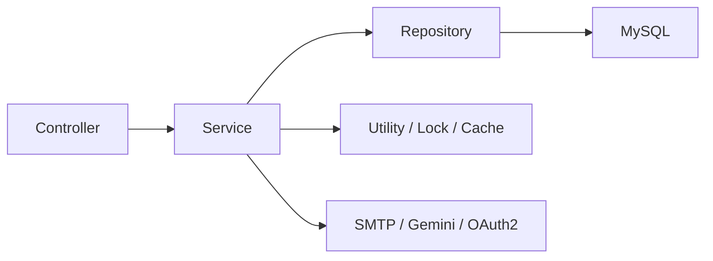

### 5-3. 공통 관심사

| 영역 | 코드 기준 역할 |
| --- | --- |
| `SecurityConfig` | Stateless 세션 정책, JWT 필터 체인 등록, OAuth2 UserService 연결, CORS 설정 |
| `JwtAuthFilter` | Authorization 헤더에서 Bearer 토큰 파싱 후 SecurityContext 구성 |
| `JwtUtil` | 토큰 생성, `userId`/`email`/`name` claim 저장, 검증 |
| `GlobalExceptionHandler` | `CustomException`, JWT 예외, 검증 예외 공통 응답 변환 |
| `CategoryExpendInitializer` | 기본 지출 카테고리 선주입 |
| `ExpendCategoryNamedLockFacadeImpl` | 커스텀 카테고리 생성 시 DB named lock 적용 |
| `FeedbackServiceImpl.cleanAndSaveFeedback` | 주 단위 피드백 정리 스케줄러 |

### 5-4. 응답/예외 처리 방식

- 성공 응답은 도메인 DTO 또는 `ReturnCodeDTO(status, message)` 형태를 사용합니다.
- 실패는 `CustomException + ErrorCode` 조합으로 처리합니다.
- DTO 검증 실패는 필드별 에러 맵으로 반환합니다.


<a id="feature-details"></a>
## 6. 상세 기능 설명

## 6-1. 인증 / 회원가입 / 비밀번호 재설정

### 관련 API

| Method | Endpoint | 설명 |
| --- | --- | --- |
| POST | `/api/send-code` | 회원가입용 이메일 인증코드 발송 |
| GET | `/api/verify` | 이메일 인증코드 확인 |
| POST | `/api/resend-code` | 인증코드 재발송 |
| POST | `/api/signup` | 회원가입 |
| POST | `/api/reset-password` | 비밀번호 재설정 코드 발송 |
| POST | `/api/confirm-reset-password` | 재설정 코드 검증 후 비밀번호 변경 |
| POST | `/api/confirm-password` | 로그인 사용자의 현재 비밀번호 확인 |

### 6-1-1. 이메일 인증 기반 회원가입 흐름

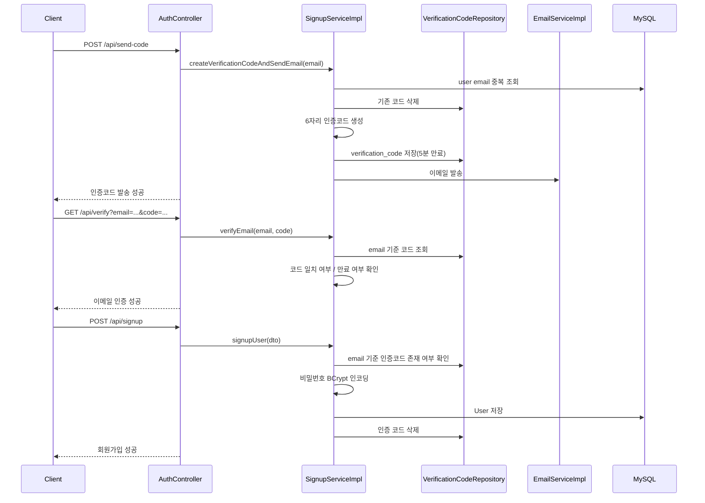

### 6-1-2. 코드 기준 핵심 포인트

- 인증코드는 `VerificationCode` 엔티티로 DB에 저장합니다.
- 만료 시간은 `LocalDateTime.now().plusMinutes(5)` 기준입니다.
- 중복 이메일은 회원가입 전에 차단합니다.
- 회원가입이 완료되면 인증코드는 삭제합니다.
- 비밀번호는 `BCryptPasswordEncoder`로 저장합니다.

### 6-1-3. 비밀번호 재설정 흐름

```mermaid
flowchart LR
    A["POST /api/reset-password"] --> B["SignupServiceImpl.createPasswordResetCode"]
    B --> C["User 존재 확인"]
    C --> D["기존 인증코드 삭제"]
    D --> E["새 6자리 코드 생성"]
    E --> F["verification_codes 저장"]
    F --> G["이메일 발송"]
    G --> H["POST /api/confirm-reset-password"]
    H --> I["코드 유효성 확인"]
    I --> J["새 비밀번호와 기존 비밀번호 비교"]
    J --> K["BCrypt 인코딩 후 User 저장"]
    K --> L["사용한 코드 삭제"]
```

## 6-2. 로그인과 JWT

### 관련 API

| Method | Endpoint | 설명 |
| --- | --- | --- |
| POST | `/api/login` | 이메일/비밀번호 로그인 후 JWT 발급 |

### 6-2-1. 로그인 흐름

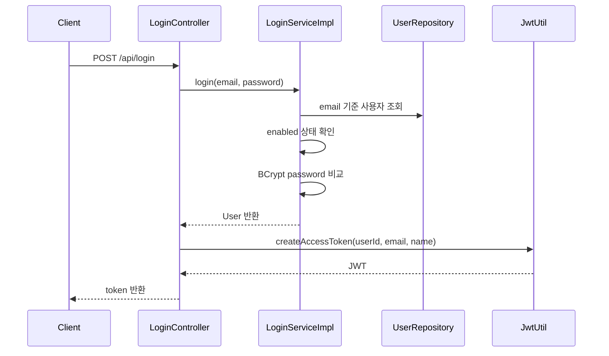

### 6-2-2. 인증된 요청 처리 방식

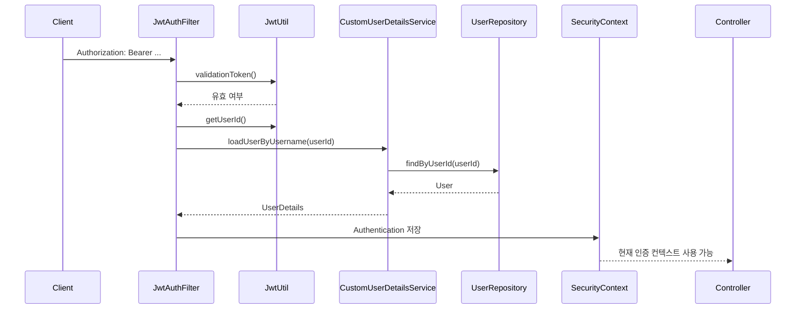

### 6-2-3. JWT에 담는 정보

- `subject`: `userId`
- `claim.userId`
- `claim.email`
- `claim.name`

즉, 단순 문자열 토큰이 아니라 이후 도메인 서비스가 바로 사용자 소유권을 검증할 수 있는 최소 정보가 들어 있습니다.

## 6-3. 프로필 조회 / 수정

### 관련 API

| Method | Endpoint | 설명 |
| --- | --- | --- |
| GET | `/api/profile` | 현재 사용자 프로필 조회 |
| PUT | `/api/profile-update` | 이름 / 닉네임 수정 |

### 6-3-1. 동작 흐름

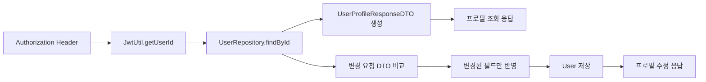

### 6-3-2. 핵심 포인트

- 프로필 수정 시 기존 값과 달라진 필드만 반영합니다.
- 변경이 없으면 기존 프로필을 그대로 반환합니다.
- 사용자 식별은 항상 JWT 내부 `userId` 기준입니다.

## 6-4. 지출 관리


### 관련 API

| Method | Endpoint | 설명 |
| --- | --- | --- |
| POST | `/api/expend` | 지출 기록 생성 |
| GET | `/api/expend/list?month=` | 월별 지출 목록 |
| GET | `/api/expend/recent` | 최근 5개 지출 |
| GET | `/api/expend/graph` | 이번 달 vs 저번 달 주차 비교 |
| GET | `/api/expend/{expendId}` | 지출 상세 조회 |
| DELETE | `/api/expend/delete/{expendId}` | 지출 삭제 |
| PUT | `/api/expend/update/{expendId}` | 지출 수정 |
| GET | `/api/expend/expendList` | 카테고리별 월간 요약 |
| GET | `/api/expend/expendList/day` | 최근 2주 일별 총지출 |

### 6-4-1. 지출 생성 흐름

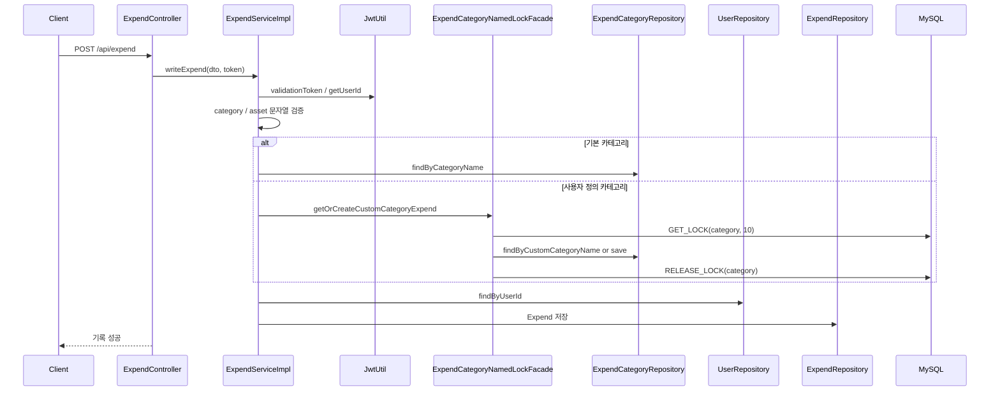


### 6-4-3. 월간 / 주간 집계 흐름

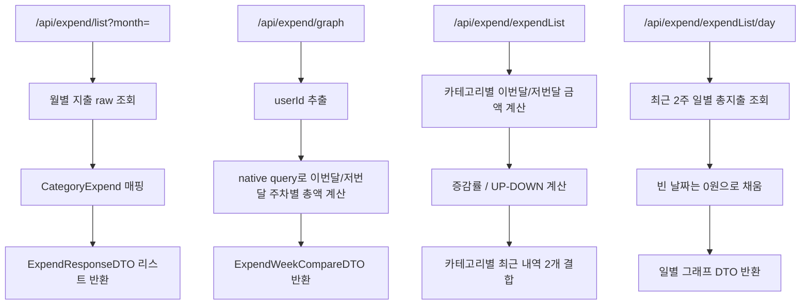

### 6-4-4. 세부 동작 포인트

- `getAmountByWeek`는 `@Cacheable("expendWeekCache")`를 사용합니다.
- 지출 생성/수정/삭제는 `@CacheEvict`로 해당 캐시를 비웁니다.
- `getAmountByMonth`는 각 카테고리별로 이번 달/저번 달 지출을 비교해 `UP`, `DOWN`, `SAME` 메시지를 만듭니다.
- `getAmountByDate`는 최근 14일을 기준으로 빈 날짜까지 채워 그래프 친화적인 응답을 만듭니다.
- 상세/수정/삭제는 모두 "이 지출이 로그인한 사용자의 것인지"를 검증합니다.

## 6-5. 수입 관리


### 관련 API

| Method | Endpoint | 설명 |
| --- | --- | --- |
| POST | `/api/income` | 수입 기록 생성 |
| GET | `/api/income/list?month=` | 월별 수입 목록 |
| GET | `/api/income/recent` | 최근 5개 수입 |
| GET | `/api/income/{incomeId}` | 수입 상세 조회 |
| DELETE | `/api/income/delete/{incomeId}` | 수입 삭제 |
| PUT | `/api/income/update/{incomeId}` | 수입 수정 |

### 6-5-1. 수입 흐름

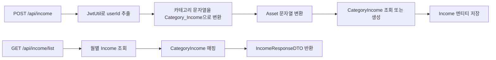

### 6-5-2. 핵심 포인트

- 수입은 enum 기반 기본 카테고리 중심으로 관리합니다.
- 저장 시 카테고리가 없으면 `CategoryIncome`을 생성해 재사용합니다.
- 지출과 마찬가지로 사용자 소유권 검증 후 상세/수정/삭제를 수행합니다.

## 6-6. 수입 + 지출 통합 거래 타임라인


### 관련 API

| Method | Endpoint | 설명 |
| --- | --- | --- |
| GET | `/api/expend-income?month=` | 월별 통합 거래내역 조회 |

### 6-6-1. 동작 흐름

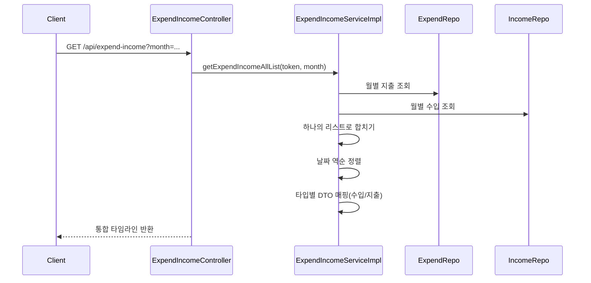

### 6-6-2. 이 API의 의미

이 API는 단순히 두 테이블을 따로 반환하는 것이 아니라,

- 같은 월의 수입과 지출을 하나의 타임라인으로 합친다.
- 날짜 기준으로 정렬한다.


## 6-7. 저축 목표

### 관련 API

| Method | Endpoint | 설명 |
| --- | --- | --- |
| POST | `/api/target/create` | 저축 목표 생성 |
| PUT | `/api/target/update/{targetId}` | 저축 목표 수정 |
| DELETE | `/api/target/delete/{targetId}` | 저축 목표 삭제 |
| POST | `/api/target/savings/{targetId}` | 특정 날짜에 목표 금액 저축 |
| GET | `/api/target/graph?month=` | 월별 목표/저축 그래프 데이터 |

### 6-7-1. 목표 생성 및 저축 누적 흐름

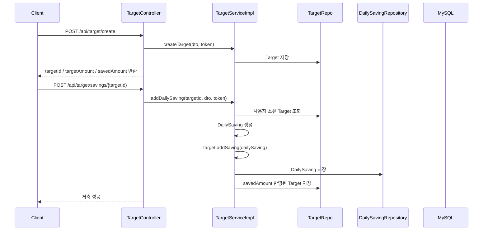

### 6-7-2. 저축 목표 그래프 흐름

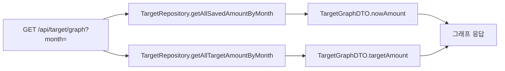

### 6-7-3. 핵심 포인트

- `Target`는 `savedAmount`를 aggregate처럼 관리합니다.
- `DailySaving`은 목표의 일별 누적 내역을 별도 테이블로 보존합니다.
- 목표 금액과 실제 저축 금액을 월 단위로 바로 비교할 수 있게 API를 제공합니다.

## 6-8. 카테고리별 지출 목표

### 관련 API

| Method | Endpoint | 설명 |
| --- | --- | --- |
| POST | `/api/category-target/create` | 카테고리 목표 생성 |
| PUT | `/api/category-target/update` | 카테고리 목표 수정 |
| GET | `/api/category-target/{category}` | 특정 카테고리 목표와 현재 지출 비교 |

### 6-8-1. 비교 흐름

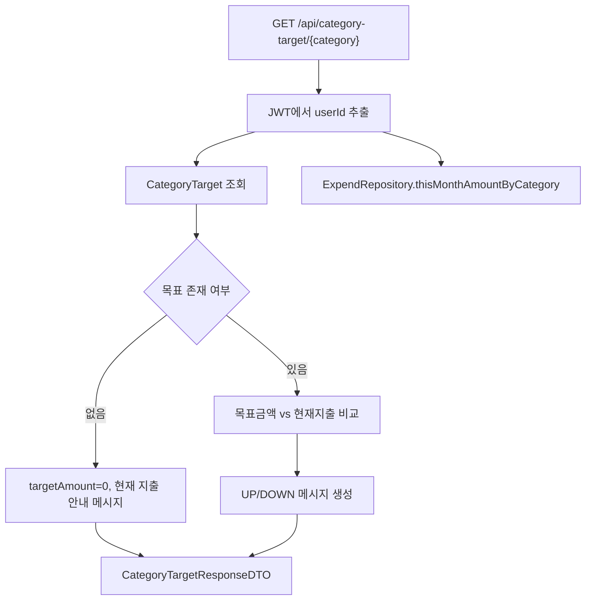

### 6-8-2. 이 기능이 좋은 이유

- 단순 목표 CRUD가 아니라 "현재 얼마나 초과/절약 중인지"까지 한 번에 말해줍니다.
- 실제 지출 합계는 `ExpendRepository.thisMonthAmountByCategory`로 바로 계산합니다.
- 목표가 없는 경우도 0원 목표로 처리해 UX가 끊기지 않게 했습니다.

## 6-9. 예정 결제 관리

### 관련 API

| Method | Endpoint | 설명 |
| --- | --- | --- |
| POST | `/api/payment` | 예정 결제 생성 |
| GET | `/api/payment/list` | 전체 예정 결제 조회 |
| DELETE | `/api/payment/delete/{paymentId}` | 예정 결제 삭제 |
| PUT | `/api/payment/update/{paymentId}` | 예정 결제 수정 |
| GET | `/api/payment/recent` | 최근 2개 예정 결제 |
| GET | `/api/payment/paymentList` | 이번 달 결제 요약 |

### 6-9-1. 결제 관리 흐름

```mermaid
sequenceDiagram
    participant Client
    participant Controller as PaymentController
    participant Service as PaymentServiceImpl
    participant UserRepo
    participant PaymentRepo

    Client->>Controller: POST /api/payment
    Controller->>Service: writePayment(dto, token)
    Service->>UserRepo: user 조회
    Service->>Service: dueDate / lastPayment 비어있는지 검증
    Service->>PaymentRepo: Payment 저장
    Controller-->>Client: 기록 성공

    Client->>Controller: GET /api/payment/paymentList
    Controller->>Service: getAmountByMonth(token)
    Service->>PaymentRepo: 이번달 / 저번달 금액 조회
    Service->>PaymentRepo: 최근 2개 결제 조회
    Service->>Service: 증감률 계산
    Controller-->>Client: 결제 요약 응답
```

### 6-9-2. 결제 도메인에서 볼 포인트

- `dueDate`, `lastPayment`를 별도 보유해 "다음 납부"와 "최근 납부"를 같이 관리합니다.
- 이번 달과 저번 달 결제액 비교 API를 따로 제공해 정기 지출 감시 기능으로 연결할 수 있습니다.
- 최근 2개의 예정 결제를 바로 반환해 홈 화면 위젯을 만들기 좋습니다.

## 6-10. 주간 AI 피드백


### 관련 API

| Method | Endpoint | 설명 |
| --- | --- | --- |
| GET | `/api/feedback` | 이번 주 지출 기반 AI 피드백 생성 또는 재사용 |

### 6-10-1. 피드백 생성 흐름

```mermaid
sequenceDiagram
    participant Client
    participant Controller as FeedbackController
    participant Service as FeedbackServiceImpl
    participant ExpendRepo
    participant FeedbackRepo
    participant Gemini as Google Gemini
    participant UserRepo

    Client->>Controller: GET /api/feedback
    Controller->>Service: sendFeedBack(token, key, url)
    Service->>UserRepo: 현재 사용자 조회
    Service->>ExpendRepo: 최신 지출 생성일 / 수정일 조회
    Service->>FeedbackRepo: 이번 주 피드백 존재 여부 조회
    alt 이번 주 피드백 있고 지출 변경 없음
        Service-->>Controller: 기존 피드백 재사용
    else 새 피드백 필요
        Service->>ExpendRepo: 카테고리별 주간 지출 합 조회
        Service->>Service: 프롬프트 생성
        Service->>Gemini: REST 호출
        Gemini-->>Service: 자연어 응답
        Service->>FeedbackRepo: 새 피드백 저장
        Service->>UserRepo: User.feedBack 연결
        Service-->>Controller: 새 피드백 반환
    end
    Controller-->>Client: 자연어 피드백 응답
```

### 6-10-2. 캐시처럼 동작하는 DB 재사용 전략

```mermaid
flowchart TD
    A["이번 주 피드백 요청"] --> B["이번 주 피드백 존재?"]
    B -- 아니오 --> C["Gemini 호출"]
    B -- 예 --> D["최신 지출 생성/수정 시각 확인"]
    D --> E{"피드백 이후 거래 변경 있음?"}
    E -- 예 --> C
    E -- 아니오 --> F["기존 피드백 재사용"]
    C --> G["feedback 테이블 저장"]
    G --> H["응답 반환"]
    F --> H
```

### 6-10-3. 이유

- 비싼 외부 AI 호출을 매번 하지 않고, 같은 주간 데이터면 재사용합니다.
- 단순 총액이 아니라 카테고리별 금액을 프롬프트에 포함해 더 맥락 있는 조언을 유도합니다.
- 사용자의 지출이 수정되면 피드백도 다시 만들어 데이터 정합성을 지킵니다.

### 6-10-4. 스케줄러

`FeedbackServiceImpl.cleanAndSaveFeedback`

- 매주 일요일 `00:00` 크론 실행
- 현재 주 시작 이전에 생성된 피드백 삭제
- 즉, 주간 피드백을 스냅샷처럼 유지하되 오래된 결과는 정리합니다.

## 6-11. Kakao OAuth2 연동 확장 포인트


### 6-11-1. 동작 흐름

```mermaid
flowchart LR
    A["Kakao OAuth2 Login"] --> B["Spring Security oauth2Login"]
    B --> C["KakaoOAuth2UserService.loadUser"]
    C --> D["properties / kakao_account 파싱"]
    D --> E["CustomUserInfoDTO 생성"]
    E --> F["JwtUtil.createAccessToken"]
    F --> G["HttpSession에 login_info / jwt_token 저장"]
```


<a id="api-inventory"></a>
## 7. API Docs

### 7-1. 인증 / 사용자

| 도메인 | Method | Endpoint |
| --- | --- | --- |
| Auth | POST | `/api/send-code` |
| Auth | GET | `/api/verify` |
| Auth | POST | `/api/resend-code` |
| Auth | POST | `/api/signup` |
| Auth | POST | `/api/reset-password` |
| Auth | POST | `/api/confirm-reset-password` |
| Auth | POST | `/api/confirm-password` |
| Login | POST | `/api/login` |
| User | GET | `/api/profile` |
| User | PUT | `/api/profile-update` |

### 7-2. 지출 / 수입 / 통합 거래내역

| 도메인 | Method | Endpoint |
| --- | --- | --- |
| Expend | POST | `/api/expend` |
| Expend | GET | `/api/expend/list` |
| Expend | GET | `/api/expend/recent` |
| Expend | GET | `/api/expend/graph` |
| Expend | GET | `/api/expend/{expendId}` |
| Expend | DELETE | `/api/expend/delete/{expendId}` |
| Expend | PUT | `/api/expend/update/{expendId}` |
| Expend | GET | `/api/expend/expendList` |
| Expend | GET | `/api/expend/expendList/day` |
| Income | POST | `/api/income` |
| Income | GET | `/api/income/list` |
| Income | GET | `/api/income/recent` |
| Income | GET | `/api/income/{incomeId}` |
| Income | DELETE | `/api/income/delete/{incomeId}` |
| Income | PUT | `/api/income/update/{incomeId}` |
| ExpendIncome | GET | `/api/expend-income` |

### 7-3. 목표 / 결제 / 피드백

| 도메인 | Method | Endpoint |
| --- | --- | --- |
| Target | POST | `/api/target/create` |
| Target | PUT | `/api/target/update/{targetId}` |
| Target | DELETE | `/api/target/delete/{targetId}` |
| Target | POST | `/api/target/savings/{targetId}` |
| Target | GET | `/api/target/graph` |
| CategoryTarget | POST | `/api/category-target/create` |
| CategoryTarget | PUT | `/api/category-target/update` |
| CategoryTarget | GET | `/api/category-target/{category}` |
| Payment | POST | `/api/payment` |
| Payment | GET | `/api/payment/list` |
| Payment | DELETE | `/api/payment/delete/{paymentId}` |
| Payment | PUT | `/api/payment/update/{paymentId}` |
| Payment | GET | `/api/payment/recent` |
| Payment | GET | `/api/payment/paymentList` |
| Feedback | GET | `/api/feedback` |

<a id="data-model"></a>
## 8. 데이터 모델

### 8-1. 핵심 ERD

```mermaid
erDiagram
    USER ||--o{ EXPEND : records
    USER ||--o{ INCOME : records
    USER ||--o{ TARGET : owns
    USER ||--o{ CATEGORY_TARGET : owns
    USER ||--o{ PAYMENT : owns
    USER ||--o| FEEDBACK : latest_feedback

    CATEGORY_EXPEND ||--o{ EXPEND : classifies
    CATEGORY_INCOME ||--o{ INCOME : classifies
    TARGET ||--o{ DAILY_SAVING : accumulates

    USER {
        bigint userId PK
        string email
        string password
        string name
        string nickName
        boolean enabled
    }

    VERIFICATION_CODE {
        bigint id PK
        string email
        string code
        datetime expiryDate
    }

    CATEGORY_EXPEND {
        bigint categoryId PK
        string categoryName
        string customCategoryName
    }

    EXPEND {
        bigint expendId PK
        bigint userId FK
        bigint categoryId FK
        bigint cost
        datetime expendDate
        string expendName
        string asset
        datetime createdAt
        datetime updateDate
    }

    CATEGORY_INCOME {
        bigint categoryId PK
        string categoryName
    }

    INCOME {
        bigint incomeId PK
        bigint userId FK
        bigint categoryId FK
        bigint cost
        datetime incomeDate
        string incomeName
        string asset
        datetime createdAt
        datetime updateDate
    }

    TARGET {
        bigint targetId PK
        bigint userId FK
        int targetAmount
        int savedAmount
        date startDate
        date endDate
    }

    DAILY_SAVING {
        bigint savingId PK
        bigint targetId FK
        date date
        int amount
    }

    CATEGORY_TARGET {
        bigint categorytargetId PK
        bigint userId FK
        string category
        bigint targetAmount
    }

    PAYMENT {
        bigint paymentId PK
        bigint userId FK
        datetime dueDate
        datetime lastPayment
        bigint cost
        string tradeName
        string paymentDetail
        datetime createdAt
    }

    FEEDBACK {
        bigint feedbackId PK
        text content
        datetime createdAt
    }
```

### 8-2. 엔티티별 의미

| 엔티티 | 의미 |
| --- | --- |
| `User` | 서비스 사용자. 인증 여부, 이름, 닉네임, 피드백 연결 보유 |
| `VerificationCode` | 회원가입/비밀번호 재설정용 6자리 인증코드 저장 |
| `Expend` | 지출 기록 |
| `CategoryExpend` | 기본 + 사용자 정의 지출 카테고리 마스터 |
| `Income` | 수입 기록 |
| `CategoryIncome` | 수입 카테고리 마스터 |
| `Target` | 저축 목표 |
| `DailySaving` | 목표에 대한 일별 저축 내역 |
| `CategoryTarget` | 카테고리별 월간 지출 목표 |
| `Payment` | 예정 결제 / 정기 납부성 지출 관리 |
| `FeedBack` | 이번 주 소비 요약 AI 피드백 |

### 8-3. 설계 포인트

- `User`가 여러 재무 도메인의 기준축이 됩니다.
- `Expend`는 `CategoryExpend`와 분리해 커스텀 카테고리 생성이 가능하게 했습니다.
- `Target`과 `DailySaving`을 분리해 목표와 실행 이력을 동시에 보존합니다.
- `FeedBack`은 사용자에게 매핑되지만, 생성 주기를 별도 스케줄로 정리합니다.

<a id="operations"></a>
## 9. 운영 / 배포 / 관측

### 9-1. 배포 구조

```mermaid
flowchart LR
    A["CI/CD 또는 배포 패키지"] --> B["CodeDeploy"]
    B --> C["appspec.yml"]
    C --> D["scripts/stop.sh"]
    C --> E["scripts/start.sh"]
    E --> F["build/libs/*.jar 복사"]
    F --> G["spring-webapp.jar 실행"]
    G --> H["EC2 애플리케이션 프로세스"]
```


<a id="testing"></a>
## 10. 테스트와 품질 관리

```mermaid
flowchart LR
    A["입력 검증"] --> B["DTO Validation"]
    B --> C["CustomException / ErrorCode"]
    C --> D["GlobalExceptionHandler"]
    D --> E["일관된 오류 응답"]

    F["성능/정합성"] --> G["Caffeine Cache"]
    F --> H["Named Lock"]
    F --> I["스케줄러"]
```

### 10-4. 테스트 이상의 품질 장치

- DTO validation annotation
- 비밀번호 BCrypt 인코딩
- 토큰 claim 검증
- 사용자 소유권 검증
- 캐시 무효화
- 주간 데이터 정리 스케줄러
- 글로벌 예외 처리


